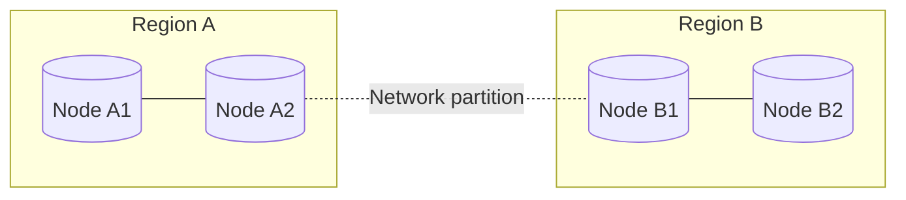
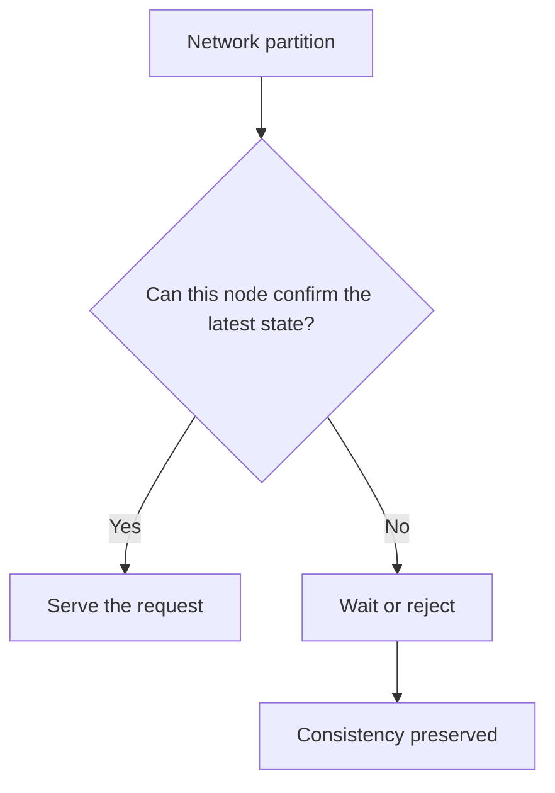
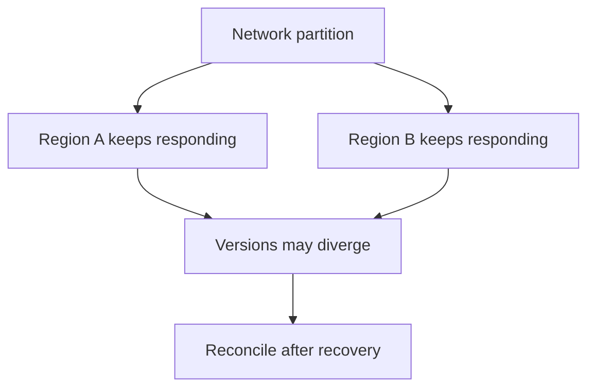
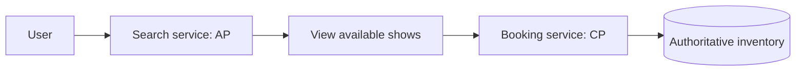

# CAP Theorem in Distributed Systems

## Summary

The **CAP theorem** explains a fundamental trade-off in distributed data systems. It considers three properties:

- **Consistency (C):** Every successful read observes the latest successful write, or the operation fails.
- **Availability (A):** Every request sent to a non-failing node eventually receives a response, even if that response may contain stale data.
- **Partition Tolerance (P):** The system continues to operate when network failures prevent some nodes from communicating.

The important rule is not simply “choose any two.” The precise idea is:

> When a network partition occurs, a distributed system must choose between preserving consistency and preserving availability.

A **CP system** may reject or delay requests during a partition to avoid returning conflicting data. An **AP system** continues responding during a partition but accepts that different nodes may temporarily hold different versions of the data.

## 1. Why CAP Matters

Distributed systems store or process data across multiple independent nodes. These nodes communicate over a network, and networks can fail.

Messages between nodes may be:

- Delayed
- Lost
- Duplicated
- Delivered out of order
- Blocked completely by a network partition

When nodes cannot communicate, they cannot immediately confirm which node has the latest data. The system must decide whether to stop some operations or continue using the information locally available.

That decision is the core of the CAP theorem.

## 2. The Three CAP Properties

### Consistency

Consistency means clients observe a single, up-to-date view of the data.

After a successful write, a later read should return that new value regardless of which node handles the request. If a node cannot guarantee the latest value, it should reject or delay the operation instead of returning stale data.

### Example

Suppose only one seat remains for a movie:

1. User A purchases the seat through Node A.
2. The available-seat count changes from `1` to `0`.
3. A request sent to Node B must not continue reporting that the seat is available.

Consistency prevents two users from successfully booking the same seat.

### Availability

Availability means every request sent to a functioning node eventually receives a response.

The response does not have to contain the newest data. The node may respond using an older local copy if it cannot communicate with other nodes.

Availability in CAP does not mean:

- Every request succeeds semantically
- The system has zero downtime under every possible failure
- Every response contains the latest value
- Responses must arrive within a fixed latency limit

It means a non-failing node does not indefinitely reject or ignore requests merely because other nodes are unreachable.

### Partition Tolerance

Partition tolerance means the system continues operating even when the network splits nodes into groups that cannot communicate reliably.



During the partition:

- Nodes inside Region A may still communicate with one another.
- Nodes inside Region B may still communicate with one another.
- Region A and Region B cannot reliably exchange updates.
- The system must decide how each side handles new requests.

## 3. Why We Cannot Guarantee All Three

Consider two database nodes containing the same value:

```text
Before partition:
Node A: seat = available
Node B: seat = available
```

A network partition then separates the nodes. A user books the seat through Node A:

```text
Node A: seat = booked
Node B: seat = available
```

Node B cannot contact Node A, so it cannot know whether its local value is current.

Node B has two possible choices:

1. **Reject or delay the next request.** This preserves consistency but sacrifices availability.
2. **Respond using its local value.** This preserves availability but may return stale data, sacrificing consistency.

No algorithm can make Node B know about an update that the failed network has prevented it from receiving. This information gap is why both consistency and availability cannot be guaranteed during a partition.

## 4. CP Systems

**CP** stands for **Consistency + Partition Tolerance**.

When a partition occurs, a CP system protects consistency. A node that cannot confirm the latest agreed state may reject writes, reject reads, or wait until it can communicate with the required nodes.



### CP Characteristics

- Prevents conflicting or stale results from being treated as authoritative
- May make part of the system temporarily unavailable
- Often uses leaders, quorums, consensus, or synchronous coordination
- Fits operations where incorrect data is worse than a rejected request

### CP Example: Booking Service

For a seat-booking operation, accepting two successful purchases for the same seat would be a serious correctness failure.

During a partition, the booking service may allow only the side containing the current leader or a quorum to accept bookings. Requests reaching the other side fail or wait.

The user may see “please try again,” but the system avoids overbooking.

### Other Possible CP Use Cases

- Financial balance updates
- Inventory deduction
- Unique username registration
- Distributed locking
- Configuration or metadata requiring a single authoritative value

## 5. AP Systems

**AP** stands for **Availability + Partition Tolerance**.

When a partition occurs, an AP system continues answering requests on both sides of the partition. Since the nodes cannot coordinate, their data may temporarily diverge.



### AP Characteristics

- Continues serving requests while nodes are disconnected
- May return stale values
- May accept conflicting concurrent updates
- Requires replication and later conflict resolution
- Often provides eventual consistency

### AP Example: Search and Recommendations

A movie-search service can keep returning results from a local index when another region is unreachable. A newly added movie or updated showtime may not appear immediately, but users can still browse.

A recommendation service can behave similarly. Slightly outdated recommendations are usually less harmful than making the entire page unavailable.

### Other Possible AP Use Cases

- Social media feeds
- Product catalogs
- Analytics dashboards
- Content discovery
- Non-critical user preferences

## 6. CP vs. AP

| Factor | CP System | AP System |
|---|---|---|
| Priority during a partition | Correct, agreed data | Continued responses |
| Sacrifice during a partition | Availability | Immediate consistency |
| Possible user experience | Request waits or fails | Response may be stale |
| Data behavior | Prevents divergent accepted state | Allows temporary divergence |
| Recovery concern | Restore unavailable operations | Reconcile conflicting versions |
| Suitable for | Correctness-critical operations | Features tolerant of stale data |
| Example | Confirming a seat booking | Browsing search results |

### Short Answer

The difference between CP and AP is the decision made when nodes cannot communicate:

- **CP:** Do not answer unless the system can preserve one correct view.
- **AP:** Answer using available local state and repair differences later.

## 7. Is CA Possible?

**CA** means providing both consistency and availability while not tolerating a network partition.

The statement that CA is possible only in a single-node system is a useful shortcut, but it is not the full picture.

- A single-node system has no network partition between database replicas, although the machine itself can still fail.
- A distributed system can provide consistency and availability while its network is healthy.
- Once a partition actually occurs, the system cannot guarantee both properties simultaneously.
- A distributed design that completely stops during a partition is not partition tolerant.

Therefore, CAP constrains behavior **during a partition**, not necessarily during normal operation.

## 8. How Partition Tolerance Works

Partition tolerance is not a mechanism that prevents network partitions. It is the system's ability to detect, survive, and recover from them.

### Common Techniques

#### Replication

Multiple nodes store copies of the data so one unreachable node does not remove every copy.

#### Timeouts and Failure Detection

Nodes use timeouts and health checks to suspect that another node is unavailable. A timeout cannot prove whether the remote node failed or the network is simply slow, so the system must handle uncertainty.

#### Quorums

Some systems require responses from a majority of replicas before accepting an operation. A majority prevents two separated minority groups from independently committing conflicting authoritative updates.

#### Leader Election

A consensus protocol may select one leader to order writes. During a partition, only the side that can establish or retain a valid quorum can safely elect a leader.

#### Local Operation

An AP system may allow each partition to keep handling requests using its local replicas.

#### Conflict Resolution

After communication recovers, divergent updates may be reconciled through:

- Version vectors
- Timestamps, with known clock-related limitations
- Last-write-wins rules
- Application-specific merge logic
- Conflict-free replicated data types
- Manual conflict resolution

#### Idempotency and Retries

Clients may retry operations after timeouts. Idempotency keys help prevent one logical action, such as a payment or booking, from being performed twice.

## 9. BookMyShow-Style Architecture

A real application does not need to make one CAP choice for every feature. Different services can make different choices.

| Service | Likely Priority | Reason |
|---|---|---|
| Search | AP | Slightly stale results are acceptable |
| Recommendations | AP | Availability matters more than immediate freshness |
| Movie details | Often AP | Older descriptive data is usually tolerable briefly |
| Seat map display | Context-dependent | A stale display may be acceptable if booking revalidates availability |
| Seat reservation | CP | Two users must not reserve the same seat |
| Payment recording | CP | Duplicate or conflicting financial state is unacceptable |

### Important Design Pattern

The search page may show a seat as available using eventually consistent data, but the final booking request must perform an authoritative consistency check.



This separation keeps browsing responsive while protecting the correctness of the transaction.

## 10. Common Misunderstandings

### “CAP Means Choose Any Two Forever”

Not exactly. The forced choice between consistency and availability applies when a partition occurs. When communication is healthy, a system may provide both.

### “AP Systems Have No Consistency”

AP systems can still provide eventual consistency, session guarantees, causal consistency, conflict resolution, or tunable consistency. They simply do not guarantee immediate consistency while remaining available during a partition.

### “CP Systems Are Always Unavailable”

CP systems sacrifice only the requests or nodes that cannot safely establish the current state. A healthy quorum may continue operating.

### “Replication Automatically Solves Partitions”

Replication makes data available in more places, but it creates the problem of coordinating or reconciling multiple copies. The system still needs a partition strategy.

### “CAP Availability Means High Uptime”

CAP availability is a formal request-response property. Operational availability also involves latency, capacity, software bugs, hardware failures, and service-level objectives.

## 11. How to Choose Between CP and AP

Ask these questions for each operation:

1. What happens if a request is rejected or delayed?
2. What happens if a client reads stale data?
3. Can two nodes safely accept conflicting writes?
4. Can conflicts be detected and merged later?
5. Is the operation financial, scarce, unique, or irreversible?
6. Can the system degrade to read-only behavior?
7. Which user experience is less harmful: an error or an outdated result?

Choose CP when accepting incorrect or conflicting state would be more harmful than temporary unavailability. Choose AP when continuing to serve users is more important and stale or conflicting data can be tolerated and repaired.

## 12. Practical Takeaways

- CAP applies to distributed systems when a network partition occurs.
- Partition tolerance is normally unavoidable when data is stored across networked nodes.
- A CP system preserves consistency by making some operations unavailable during a partition.
- An AP system preserves availability by allowing temporary inconsistency.
- CA can describe healthy operation, but it cannot be guaranteed through a partition.
- Different services within the same application can make different trade-offs.
- Booking and payment paths usually need stronger consistency than search and recommendation paths.
- Partition recovery, conflict resolution, retries, and idempotency are essential parts of the design.

## Quick Revision

- **Consistency:** Reads observe the latest successful write or fail.
- **Availability:** Every request to a non-failing node eventually receives a response.
- **Partition:** A communication failure divides nodes into groups that cannot coordinate.
- **Partition tolerance:** The system continues operating despite that communication failure.
- **CP:** Preserve correct, agreed state; some requests may wait or fail.
- **AP:** Keep responding; data may temporarily diverge.
- **Why not all three?** A disconnected node cannot know whether another node accepted a newer update.
- **Booking example:** Use CP to prevent overbooking.
- **Search example:** Use AP so users can continue browsing with possibly stale results.
