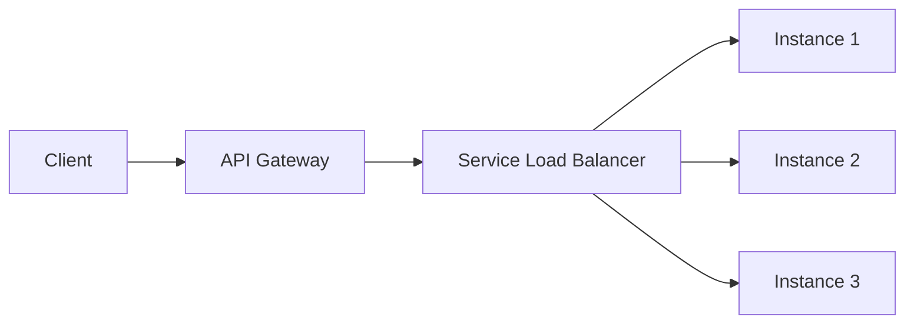
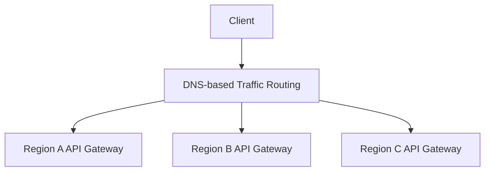

# API Gateway vs. Load Balancer in Microservices

> Summary of a video from the *Ultimate System Design* playlist.

## Overview

An **API Gateway** and a **Load Balancer** both help route traffic, but they operate at different levels:

- An **API Gateway** routes a client request to the correct **microservice**.
- A **Load Balancer** routes that request to a healthy **instance** of the selected microservice.

## API Gateway

**Video section:** 0:45–15:10

The API Gateway acts as the **single entry point** for client requests. It hides the internal microservice architecture, so clients do not need to know which services exist or where they are running.

### Main responsibilities

#### 1. API composition

**Timestamp:** 7:24

The gateway can combine or tailor responses for different clients. For example, a mobile application may need a smaller response than a desktop application.

#### 2. Authentication and authorization

**Timestamp:** 9:40

The gateway can validate access tokens and permissions centrally. This avoids repeating the same authentication logic in every microservice.

#### 3. Service discovery

**Timestamp:** 11:19

The gateway uses service-discovery information to find active services and their network locations, such as IP addresses and ports, before routing requests.

## Load Balancer

**Video section:** 15:16–19:43

A Load Balancer distributes traffic across multiple **instances of the same microservice**. This improves availability, prevents individual instances from becoming overloaded, and allows the service to scale horizontally.

### Key distinction

| Component | Routing decision | Example |
| --- | --- | --- |
| API Gateway | Which service should handle the request? | Route `/orders` to the Order Service |
| Load Balancer | Which instance of that service should handle it? | Route to Order Service instance 2 |

## Typical Request Flow

> In a real deployment, the exact placement of the service-level load balancer depends on the platform. The important distinction is that the gateway selects the service, while load-balancing logic selects an instance.

## Handling Scale and Global Traffic

**Video section:** 20:30–33:15

### DNS-based regional routing

**Timestamp:** 20:41

For systems serving millions of requests, DNS-based traffic routing can direct a client to the closest healthy geographical region. Each region can expose its own API Gateway, reducing latency for users.

### Fault tolerance

**Timestamp:** 29:34

Health checks detect failures at the Availability Zone or regional level. If an AZ or an entire region becomes unavailable, traffic can be redirected to the next healthy location to maintain uptime.

## Final Takeaway

The two components solve complementary routing problems:

1. **DNS or a global traffic manager** selects a healthy region.
2. The **API Gateway** selects the correct microservice and applies cross-cutting policies.
3. The **Load Balancer** selects a healthy instance of that microservice.

Together, they provide a scalable, available, and client-friendly entry path into a microservices system.
