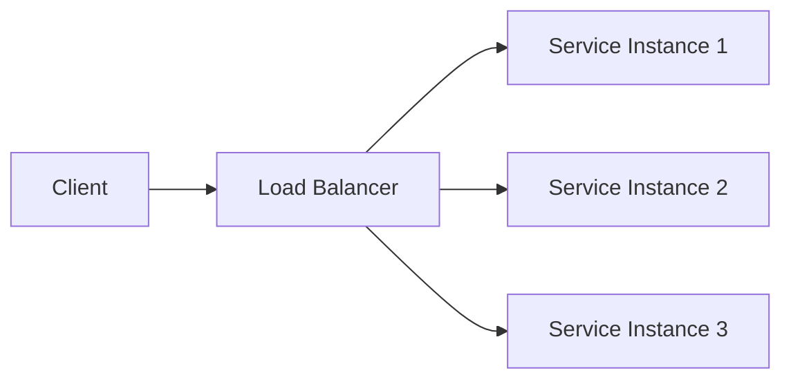

# Load Balancers: Types and Traffic-Distribution Algorithms

> Summary of a video from the *Ultimate System Design* series.

## What Is a Load Balancer?

A **load balancer** distributes incoming network traffic across multiple instances of a service. It becomes important when a system scales horizontally by running several copies of the same application or microservice.



### Main responsibilities

- Distribute traffic across service instances.
- Prevent a single instance from becoming overloaded.
- Perform health checks on registered instances.
- Stop routing traffic to unhealthy or unavailable instances.
- Improve system scalability and availability.

Although the load balancer acts as a central entry point logically, production deployments usually run it redundantly so that it does not become a single point of failure.

## Types of Load Balancers

Load balancers are commonly classified by the OSI model layer at which they operate.

### Layer 4 Load Balancer

A **Layer 4 load balancer** operates at the transport layer and works with TCP or UDP traffic.

It routes traffic using connection-level information such as:

- Source IP address
- Destination IP address
- Source and destination ports
- Transport protocol

Because it does not inspect application content, Layer 4 load balancing is generally fast and efficient. However, it cannot make routing decisions based on URLs, HTTP headers, cookies, or request bodies.

### Layer 7 Load Balancer

A **Layer 7 load balancer** operates at the application layer. It understands application protocols such as HTTP and HTTPS and can inspect request content.

It can route traffic using information such as:

- URL paths
- Hostnames
- HTTP methods
- Headers
- Cookies
- Query parameters

For example, it can route `/users` to the User Service and `/orders` to the Order Service. This provides more flexible routing but requires more processing than Layer 4 load balancing.

### Layer 4 vs. Layer 7

| Characteristic | Layer 4 | Layer 7 |
| --- | --- | --- |
| OSI layer | Transport | Application |
| Common protocols | TCP and UDP | HTTP and HTTPS |
| Routing information | IP addresses, ports, protocol | Paths, hosts, headers, cookies, methods |
| Content awareness | No | Yes |
| Performance | Generally faster | More processing overhead |
| Typical use | High-throughput network traffic | Content-aware application routing |

## Load-Balancing Algorithms

Load-balancing algorithms determine which healthy server should receive the next request. They can be divided into **static** and **dynamic** algorithms.

## Static Algorithms

Static algorithms make decisions using predefined rules. They do not continuously adjust routing based on current server load or response performance.

### Round Robin

**Round Robin** sends requests to servers sequentially:

```text
Request 1 → Server A
Request 2 → Server B
Request 3 → Server C
Request 4 → Server A
```

It is simple and works well when servers have similar capacity and requests require roughly equal amounts of work.

**Limitation:** Equal request counts do not guarantee equal workloads. One request may be much more expensive than another.

### Weighted Round Robin

**Weighted Round Robin** assigns a weight to each server based on its capacity. A server with a larger weight receives a greater share of requests.

For example:

| Server | Weight | Approximate traffic share |
| --- | ---: | ---: |
| Server A | 5 | 50% |
| Server B | 3 | 30% |
| Server C | 2 | 20% |

This is useful when the server pool contains machines with different processing capabilities.

### IP Hash

**IP Hash** applies a hash function to the client's IP address and uses the result to select a server.

```text
selected server = hash(client IP) mod number of servers
```

The same client will usually be routed to the same server, providing a form of session affinity.

**Limitations:**

- Clients behind the same proxy or NAT may appear to have the same IP address.
- Adding or removing servers can change the mapping for many clients.
- Sticky routing can produce uneven traffic distribution.

## Dynamic Algorithms

Dynamic algorithms use current runtime information, such as connection counts or response times, when selecting a server.

### Least Connections

**Least Connections** sends a new request to the server with the fewest active connections.

This works well when connections remain open for different lengths of time, such as WebSocket connections or long-running requests.

**Limitation:** Connection count does not always represent actual resource usage. Some connections may perform much more work than others.

### Weighted Least Connections

**Weighted Least Connections** considers both active connections and server capacity. More powerful servers can accept more connections before being treated as heavily loaded.

A simplified comparison can be expressed as:

```text
load score = active connections / server weight
```

The request is routed to the healthy server with the lowest load score.

### Least Response Time

**Least Response Time** routes traffic using observed server latency, often combined with active connection counts. Time to First Byte can be used as one of the response-time measurements.

This algorithm attempts to send requests to the server currently responding the fastest.

**Limitations:**

- Measurements must be updated continuously.
- Network latency can temporarily distort results.
- A server that was recently fast may become overloaded if too much traffic is redirected to it.

## Algorithm Comparison

| Algorithm | Uses live metrics? | Best suited for | Main limitation |
| --- | --- | --- | --- |
| Round Robin | No | Similar servers and uniform requests | Ignores workload differences |
| Weighted Round Robin | No | Servers with different capacities | Weights require correct configuration |
| IP Hash | No | Basic client affinity | Can create uneven distribution |
| Least Connections | Yes | Long-lived or uneven connections | Connections may have different costs |
| Weighted Least Connections | Yes | Mixed server capacities and connection loads | Requires weights and connection tracking |
| Least Response Time | Yes | Latency-sensitive applications | Sensitive to noisy or stale measurements |

## Choosing an Algorithm

The right choice depends on the workload:

- Use **Round Robin** for simple, uniform workloads.
- Use **Weighted Round Robin** when servers have different capacities.
- Use **IP Hash** when basic client affinity is required, while considering its limitations.
- Use **Least Connections** for long-lived or highly variable connections.
- Use **Weighted Least Connections** when both capacity and active connections matter.
- Use **Least Response Time** when current latency is the most important signal.

In practice, health checks, connection draining, retries, timeouts, and observability are just as important as the selected distribution algorithm.

## Final Takeaway

A load balancer improves scalability and availability by routing traffic only to healthy service instances. Layer 4 load balancers prioritize speed and connection-level routing, while Layer 7 load balancers provide application-aware routing. The distribution algorithm determines how effectively traffic is spread across the available servers.
